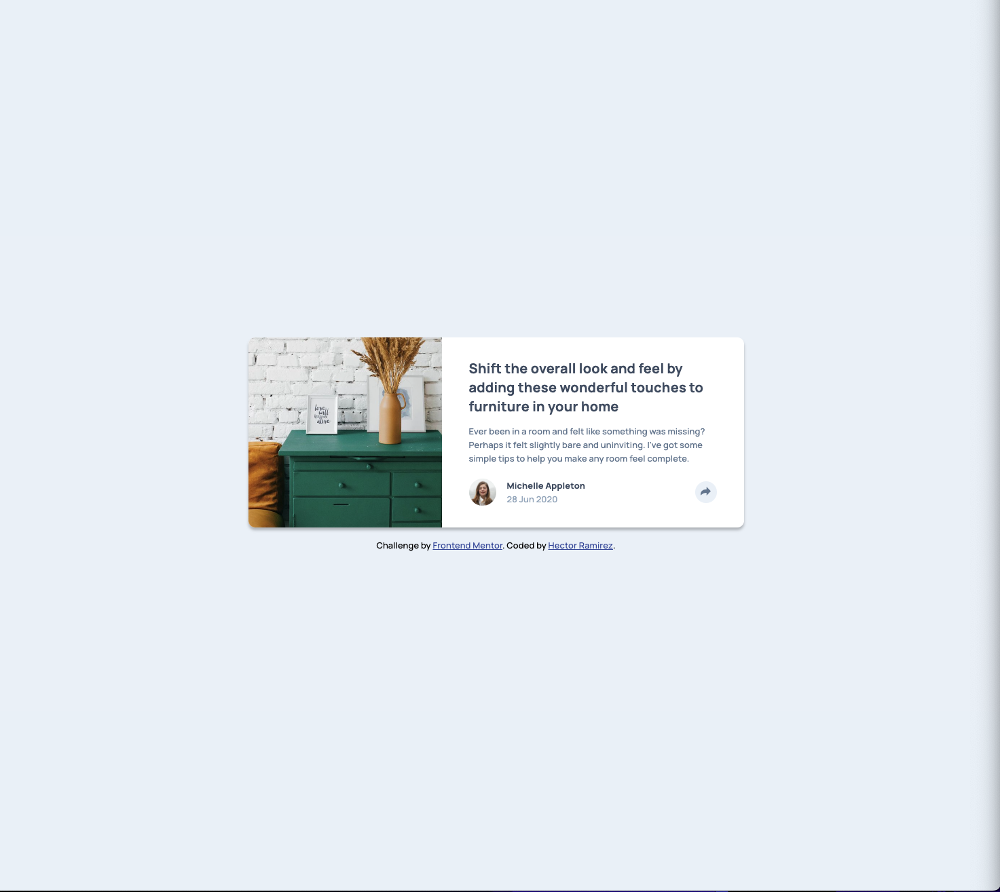
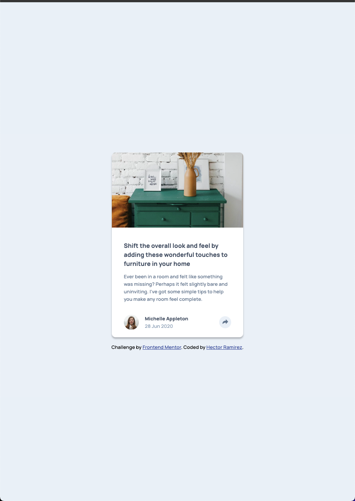

# Frontend Mentor - Article preview component solution

This is a solution to the [Article preview component challenge on Frontend Mentor](https://www.frontendmentor.io/challenges/article-preview-component-dYBN_pYFT). Frontend Mentor challenges help you improve your coding skills by building realistic projects.

## Table of contents

- [Overview](#overview)
  - [The challenge](#the-challenge)
  - [Screenshot](#screenshot)
  - [Links](#links)
- [My process](#my-process)
  - [Built with](#built-with)
  - [What I learned](#what-i-learned)
  - [Continued development](#continued-development)
  - [Useful resources](#useful-resources)
- [Author](#author)

## Overview

### The challenge

Users should be able to:

- View the optimal layout for the component depending on their device's screen size
- See the social media share links when they click the share icon

### Screenshot




### Links

- Solution URL: [Solution URL here](https://github.com/hectorlil48/article-preview-component)
- Live Site URL: [Live site URL here](https://hectorlil48.github.io/article-preview-component/)

## My process

### Built with

- Semantic HTML5 markup
- CSS custom properties
- Flexbox
- Mobile-first workflow
- Javascript

### What I learned

I struggled with this project. I am still trying to understand CSS positioning and I'm not very confident about it. However, I managed to get the popup div to overlay the under div when it is clicked on, and I successfully aligned my divs as I wanted. I definitely need more practice with CSS positioning. JavaScript wasn't too difficult—I was able to add the hidden class to my button along with the active styles.

```css
.share-box {
  width: 248px;
  height: 55px;
  background-color: hsl(217, 19%, 35%);
  border-radius: 10px;
  color: #fff;
  position: absolute;
  left: 224px;
  bottom: 64px;
  box-shadow: 0px 4px 4px 0px rgba(0, 0, 0, 0.25);
}
```

```js
shareButton.addEventListener("click", () => {
  shareBox.classList.toggle("hidden");
  shareButton.classList.toggle("active");
});
```

### Continued development

I want to continue working with CSS positioning in order to improve my understanding. Additionally, I plan to practice using Javascript to enhance my skills.

### Useful resources

- [W3Schools](https://www.w3schools.com/) - W3Shools is the place I find anything I want to find out how to use. This time it was understanding CSS positioning.
- [Google](https://www.google.com/webhp?hl=en&sa=X&ved=0ahUKEwjunvn4xP3-AhX4j4kEHS7LCRwQPAgJ) - You can find almost anything on Google. It helped me get used to using position in my CSS.

## Author

- GitHub - [Hector Ramirez](https://github.com/hectorlil48)
- Frontend Mentor - [@hectorlil48](https://www.frontendmentor.io/profile/hectorlil48)
- LinkedIn - [@linkedin.com/in/hector-ramirez-6a6509170](https://www.linkedin.com/in/hector-ramirez-6a6509170/overlay/contact-info/)
